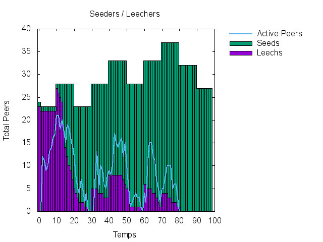

# peersim-tools
A few tools to play with peersim outpout

## Bash scripts

The bash scripts parse the outpout of the bitpeer simulator (run peersim and redirect the outpout in a file. Then parse it with the script)
process2.sh and process3.sh do the same thing, only process3 is a bit faster (still slow)
process.sh  only lightly filter the outpout to do a basic plot.

## Jar File

The jar file contains the BitpeerParser class which does the same as process3.sh but imensely faster.
run it with `java -cp bitpeerParser.jar BitpeerParser sample/result.txt`
It will print a log message every now and then to give you an idea of the progress.

Once it is done you can plot the result : 
`gnuplot gnuplotXX` where `gnuplotXX` here the file created by the java script. Delete the temporary file afterward (`gnuplotXX` and `dataXX`)

Example output : 

